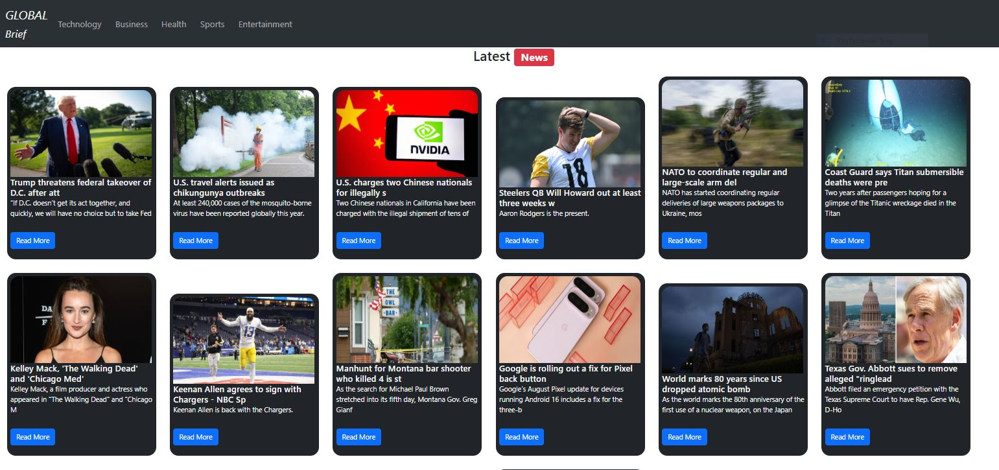

# 🌐 Global Brief - React News App

**Global Brief** is a responsive and modern news application built with ReactJS. It fetches real-time news based on different categories using a news API and displays them in beautiful, dark-themed cards. Users can explore categories like Technology, Business, Health, Sports, and Entertainment.

---

## 🚀 Features

- 🔍 Category-based news filtering
- 📰 Clean card-based news layout
- 🌙 Dark theme with a professional UI
- 📱 Responsive design (mobile + desktop)
- ⚡ Fast rendering with React hooks and Bootstrap 5

---

## 📸 Screenshot

---

## 🛠️ Tech Stack

- **Frontend**: React.js, Bootstrap 5
- **Styling**: Custom CSS + Bootstrap utilities
- **State Management**: React Hooks (`useState`)

---

